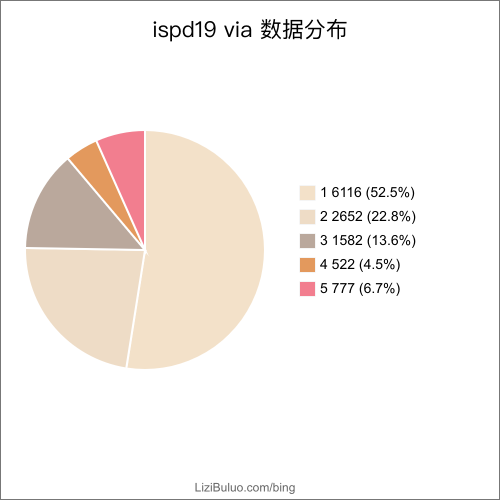
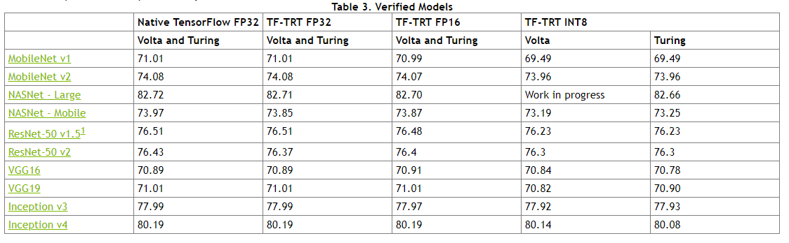

# exp

| Time                | Name/Epoch                         | miou/runtime/picacc  | Epe/runtime                                                  | PVB                                                          | FC/miou/pixacc/runtime | FC/EPE | FC/PVB |
| ------------------- | ---------------------------------- | -------------------- | ------------------------------------------------------------ | ------------------------------------------------------------ | ------------------- | ------------------- | ------------------- |
| 2020-04-03 10:19:54 | ovia1_e70_dr2mg                    | 0.9958/596/0.9960    | {'GAN': 0.9075, 'CALI': 0.6160000000000005}                  | {'GAN': 0.002839090000000001, 'CALI': 0.0028710640000000035}% | 0.9847/0.9920/4716.65 | 1.0461/0.42301 | 0.002784005/0.002839618 |
| 2020-04-17 10:20:16 | ovia1pixhd_e100_1024_dr2mg_D2d1 | 0.9986:/257.91/0.9995 | {'GAN': 0.8818745, 'CALI': 0.62750 | 'GAN': 0.0028338075, 'CALI': 0.002866523 | 0.9846/0.9921/3926 | 1.0065/0.3644 |'GAN': 0.002778561, 'CALI': 0.00282592|
| 2020-03-31 19:24:16 | ovia2pixhd_e100_1024_local_dr2mg/  | 0.9759/179.95/0.9965 | {'GAN': 0.9655837004405287, 'CALI': 0.5019273127753312}      | {'GAN': 0.005414667400881053, 'CALI': 0.005522425110132153}  | 0.96227/0.98874/1287.58 | 1.0829/0.46179 | 0.005517944/0.005598528 |
| 2020-03-31 19:15:32 | ovia2pixhd_e100_dr2mg/             | 0.9851/223.4/0.9951  | {'GAN': 0.9892621145374447, 'CALI': 0.5019273127753312}total runing time 5094.13487983, | {'GAN': 0.00542066299559471, 'CALI': 0.005522425110132153}   | 0.9613/0.9852/1768.68 | 1.2455/0.46179 | 0.005558288/0.005598528 |
| 2020-03-31 20:00:44 | ovia2_e70_dr2mg                    | 0.9623/306.49/0.9750 | {'GAN': 2.379347619047623, 'CALI': 1.0801416194674531}       | pvb:{'GAN': 0.005252550999999999, 'CALI': 0.005519710000000001} |  |  |  |
| 2020-03-31 19:25:06 | ovia3pixhd_e100_1024_dr2mg/        | 0.9824/174.89/0.9918 | :{'GAN': 1.2206249999999998, 'CALI': 0.5743749999999992}/4535 | {'GAN': 0.008087915000000001, 'CALI': 0.008269802500000001}  | 0.9526/0.9771/995.47 | 1.2572/0.50645 | 0.008127402/0.008276026 |
| 2020-04-07 10:13:50 | ovia3pixhd_e100_1024_good_dr2mg_D1d1        | 0,9439/198/0,9877/  | 'GAN': 1.7094324540367727, 'CALI': 0.53497202238209         | 'GAN': 0.008029717026378898, 'CALI': 0.008210478417266184  | 0.9332/0.98050/965.62 | 1.8961/0.50645 | 0.008122579/0.008276026 |
| 2020-04-06 16:43:10 | ovia4pixhd_e100_1024_good_dr2mg_D1d1/latest | 0.9857/248/0.9970   | 'GAN': 1.0626250000000004, 'CALI': 0.5327499999999993}/6000 | 'GAN': 0.010632461000000005, 'CALI': 0.01085782799999999   | 0.9633/0.9855/311.27 | 1.3167/ | 0.01066543/0.01092376 |
| 2020-03-31 19:33:46 | ovia4pixhd_e100_1024_dr2mg_nd1/    | 0.9754/183.66/0.9970 | :{'GAN': 1.1409375000000002, 'CALI': 0.5835937500000008}/5333 | {'GAN': 0.010479049999999997, 'CALI': 0.0106968625}          | 0.9563/0.9869/320 | 1.4613/0.5308 | 0.01067668/0.01092376 |
| 2020-03-24 19:33:03 | ovia4pixhd_e100_1024_dr2mg/        | 0.9810/195.15/0.9920 | ovia4pixhd_e100_1024_dr2mg_seen {'GAN': 1.3071875000000004, 'CALI': 0.5835937500000008}/4676 | pvb{'GAN': 0.01043086624999999, 'CALI': 0.0106968625}%       | 0.96161/0.98130/322.59 | 1.4487/0.5308 | 0.01064581/0.01092376 |
| 2020-03-24 19:37:36 | ovia4pixhd_e100_1024_dr2mg_unseen/ | 0.9793/196.63/0.9907 | :{'GAN': 1.35109375, 'CALI': 0.5384375000000005}/4695        | {'GAN': 0.010636713749999995, 'CALI': 0.01090191500000}      |  |  |  |
| 2020-03-31 18:21:47 | ovia4pixhd_e100_1024_good_dr2mg/   | 0.9664/160.7/0.9825  | {'GAN': 1.6869517543859653, 'CALI': 0.5239400584795316}/4076 | {'GAN': 0.010538478070175437, 'CALI': 0.010848168128654969}% |  |  |  |
| 2020-03-31 19:41:26 | ovia4pixl1_e100_1024_dr2mg/        | 0.9507/192.58/0.9840 | 'GAN': 2.0985937499999987, 'CALI': 0.5835937500000008        | {'GAN': 0.01062245625000001, 'CALI': 0.0106968625}%          |  |  |  |
| 2020-03-27 19:43:42 | ovia4pixlr_e100_1024_dr2mg/        | 0.9332/193.67/0.9623 | {'GAN': 2.0985937499999987, 'CALI': 0.5835937500000008}p     | {'GAN': 0.01062245625000001, 'CALI': 0.0106968625}           |  |  |  |
| 2020-03-31 19:45:49 | ovia5pixhd_e100_1024_good_dr2mg/   | 0.9762/246.46/0.9894 | results:{'GAN': 1.085299999999999, 'CALI': 0.47309999999999997} | {'GAN': 0.013274572999999998, 'CALI': 0.013508918000000007}% | 0.9264/0.9568/498/ | 2.2595/0.76888 | 0.01134321/0.01208712 |
| 2020-03-31 19:44:23 | ovia5pixhd_e100_1024_dr2mg/        | 0.9685/352.45/0.9858 | :{'GAN': 1.3962837837837856, 'CALI': 0.5916891891891892}/9151 | {'GAN': 0.012938752027027042, 'CALI': 0.013258245945945931}% | 0.968099/0.98079 | 2.0164/0.76888 | 0.01142896/0.01208712 |
| 2020-04-06 17:26:31 | ovia5pixhd_e100_1024_good_dr2mg_D1d1/       | 0.97012/241/0.9868  | 'GAN': 1.6044834307992197, 'CALI': 0.4705653021442495       | GAN': 0.01326736744639377, 'CALI': 0.013510842105263161    | 0.9219/0.9554/511 |  |  |
| 2020-04-07 10:30:38 | ovia5pixl1_e100_1024_dr2mg                  | 0.9481/348/0.9720   | GAN_mean_epe: 2.3839 CALI_mean_epe: 0.59169                 | GAN_mean_pvb: 0.01268937 CALI_mean_pvb: 0.01325825         |  |  |  |
| 2020-04-15 17:25:10 | ovia6pixhd_e100_1024_good_dr2mg_D2d1        | 0.9772/237/0.9900   | GAN': 1.3665865384615383, 'CALI': 0.46947115384615384       | 'GAN': 0.015730991346153845, 'CALI': 0.016074303846153867} | 0.94102/0.9675/36 | 2.2909/.82602 | 0.01434126/0.01512242 |
| 2020-03-31 19:46:45 | ovia6pixhd_e100_1024_good_dr2mg/   | 0.9597/253.35/0.9799 | {'GAN': 1.4513621794871803, 'CALI': 0.46947115384615384}     | {'GAN': 0.015720375961538482, 'CALI': 0.016074303846153867}% | 0.9179/0.9561/37 | 1.9583/0.82602 | 0.01451863/0.01512242 |
| 2020-04-02 08:40:06 | ovia6pixhd_e100_1024_dr2mg         | 0.9587/339.67/0.9773 | {'GAN': 1.8351891762452106, 'CALI': 0.5997964559386969}      | {'GAN': 0.015215767241379314, 'CALI': 0.015827579022988512}% |  |  |  |
| 2020-04-03 10:15:27 | layouts05frac48via12_e100          | 0.9689/596/0.9886    | {'GAN': 1.4421639148588756, 'CALI': 1.0589298377261465}      | {'GAN': 0.004196499499999993, 'CALI': 0.004195387000000007}% |  |  |  |
| 2020-04-18 20:30:43 | ovia2pixhd_e100_1024_good_dr2mg_D2d1 | 0.9445//0.9908 | 'GAN': 1.93125 CALI': 0.33125 |                                                            | 0.9468/0.9899 | 1.5244/0.46026 | 0.005492291/0.00559957 |
|                     | ovia3D2d1 |                     |  |                                                            |  |  |  |
|                     | orect1pixhd_e50_1024_dr2mg_D1d（via 70*70) | 0.9975/0.9992 | GAN': 0.2764，'CALI': 0.227 | 'GAN': 0.002917016, 'CALI': 0.002917813 | 0.9843/0.9920 |  |  |
| | ispd rect v1 (via 70 有400个) | | | | | | |
| |  | | | | | | |
| |  | | | | | | |
| |  | | | | | | |

从图上表明：

EPE和pixacc有相关关系。在pixAcc上升miou下降的情况下，EPE效果变好，pvband效果变好。

## 接下来的实验计划

1. 首先good_seen数据集是好的，用这个做。
2. 加l1是不是真的很差劲得在ovia5的数据集上验证一遍。
3. 其他的方式有多烂得做一遍。

所以：

1. 验证nd1和更少的D会不会有更好的效果。
2. 小实验验证
3. 全部采用最好效果 跑一遍实验。
4. 将epe的测量放到gpu上来做。
5. 写一个util记录每次的实验结果

6532的good_nd1

V6D1 V5D1

V3D1 V4D1
o的l1·

## ispd19

1. 效果展示

2. 数据分布

{'1': 6104, '2': 2622, '3': 1511, '4': 489, '5': 792, '6': 57}

总共 11575个window，16035个via。

## Performance

time:

Calibre: total runing time 6111.46761703s

ispd19_mbsraf results:{'CALI': 0.537246227093065}pvb:

{'CALI': 61.3132}

DLS-DMO:

split window: 232.2s

gds2png: 546.4s

inference:  3952.2s /6111 (0.64s) (1batch 1gpu)

Predicted 231.5s (4batch 8 gpu)

png2gds: 3617s( predicted 64 process 1 cpu)

Total process 232+ 546 + 3617 = 4395s(gds2png png2gds)

total predict 4395 + 231.5 = 4626.5

----------------

EPE 0.9075(our dataset) 0.97(ispd19)

## ISPD 19 results

------

1

|         | EPE     | Pvb                 |
| ------- | ------- | ------------------- |
| 1       | 0.8865  | 0.002778561（6104） |
| 2       | 0.9615  | 0.005517944（2622） |
| 3       | 1.2572  | 0.008127402（1511） |
| 4       | 1.3167  | 0.01066543（489）   |
| 5       | 1.5164  | 0.01134321（792）   |
| 6       | 1.7583  | 0.01451863（57）    |
| 平均    | 1.0158  | 58.6745             |
| calibre | 0.53724 | 61.3132             |

# new REC

| Time                | Name/Epoch                         | miou/runtime/picacc  | Epe/runtime                                                  | PVB                                                          | FC/miou/pixacc/runtime | FC/EPE | FC/PVB |
| ------------------- | ---------------------------------- | -------------------- | ------------------------------------------------------------ | ------------------------------------------------------------ | ------------------- | ------------------- | ------------------- |
| 2020-04-25 11:15:31 | orect1pixhd_e50_1024_dr2mg_D1d1 | 0.9975/0.9992/321 | 0.2765/0.227 | GAN': 0.002917016, 'CALI': 0.0029178130 | 0.9843/0.9920/3959 | 0.32626/0.27281 | GAN:0.002848592 CALI:0.002857148 |
| | orect2pixhd_e50_1024_good_dr2mg_D2d1 | 0.9791/0.9930 | | | | | |
| | orect2pixhd_e100_1024_good_dr2mg_D1d1_failed | 0.9774/0.9923 | 0.8245/0.41425 | 0.005576935 0.005594728 | 0.9649/0.9859/1742 | 0.96/0.45488 | 0.005654889 0.005670302 |
| | orect3pixhd_e100_1024_dr2mg_D2d1 | 0.9846/0.9949 | 0.82133/0.54133 | 0.008285826 0.008271045 | 0.9569/0.9825 | 1.4257/0.49795 | 0.008405875 0.008351878 |
| | orect3pixhd_e100_1024_good_dr2mg_D2d1 | 0.9758:/0.9912 | 0.98401/0.48241 | GAN_mean_pvb: 0.008285935 CALI_mean_pvb: 0.008287007 | 0.9450/0.9753/1031 | 1.6551/0.49795 | GAN:0.008303745 CALI:0.008351878 |
| | orect4pixhd_e100_1024_good_dr2mg_D1d1 | 0.9838/0.9927 | 0.87777/0.49504 | 0.01094645 0.01097539 | 0.9597/0.9794 | 1.309/0.55316 | 0.01094688 0.01105141 |
| | orect4pixhd_e100_1024_good_dr2mg_D2d1 | 0.9574/0.9864 | 2.1406/0.49221 | 0.01096193 0.01097539 | 0.9356/0.9760/341. | 2.8942/0.55316 | 0.01098148 0.01105141 |
| | orect5pixhd_e100_1024_good_dr2mg_D2d1 | 0.9833/0.9930 | 0.73417/0.485 | 0.01364073 0.01366318 | 0.9533/0.9693/495 | 1.9272/0.82143 | 0.01161022 0.01230583 |
| | oisrect5pixhd_e100_1024_dr2mg_D1d1 | | | | 0.7569/0.9923 | 1.4649/0.82143 | 0.0122517 0.01230583 |
| | oisrect3pixhd_e100_1024_dr2mg_D2d1 | | | | | | |
| | ispdv1 | | | | | |  |
| | orect1pixhd_e50_1024_dr2mg_D1d1_fc5 | | | | 98.43/99.20 | | |
| |  | | | | | | |

Fc5: 将clips都切成max via 是5的window

total 11649 window increase  11649 - 11575 = 74

now set via num 1: to be 6116 data
via num 2: has 2652 data
now set via num 2: to be 2652 data
via num 4: has 522 data
now set via num 4: to be 522 data
via num 3: has 1582 data
now set via num 3: to be 1582 data
via num 5: has 777 data
now set via num 5: to be 777 data

|                 | EPE (our model/calibre) on our training set) | EPE(our model)ISPD19             |
| --------------- | -------------------------------------------- | -------------------------------- |
| 1               | 0.2765/0.227 (1600 train image)              | 0.32（比上周下降了0.5）(52.5%)   |
| 2               | 0.8245/0.41425(1600 train image)             | 0.9115（比上周下降了0.1）(22.8%) |
| 3               | 0.82133/0.54133(1600 train image)            | 1.2572（并未下降）(13.6%)        |
| 4               | 0.87777/0.49504(1600 train image)            | 1.2967（下降0.01）(4.5%)         |
| 5               | 0.73417/0.485(1600 train image)              | 1.4649（下降0.1）(6.7%)          |
| 平均            | 0.7068                                       | 0.702（比上周小0.3）             |
| calibre         | 0.432524                                     | 0.53724                          |
| 上周有bug的平均 |                                              | 1.0158                           |

|                 | PVB (our model/calibre) on our training set) | PVB(our model)ISPD19    |
| --------------- | -------------------------------------------- | ----------------------- |
| 1               | 0.002917016/0.0029178130                     | 0.002848592/0.002857148 |
| 2               | 0.005576935/0.005594728                      | 0.005654889/0.005670302 |
| 3               | 0.008285826/0.008271045                      | 0.008127402/0.008276026 |
| 4               | 0.01094645/0.01097539                        | 0.01094688/0.01105141   |
| 5               | 0.01364073/0.01366318                        | 0.0122517/0.01230583    |
| calibre         | 61.3132                                      | 60.51                   |

| vianum | Name                                  | L2loss(our) | std L2(our) | L2loss(calibre) | std L2(cali) |
| ------ | ------------------------------------- | ----------- | ----------- | --------------- | ------------ |
| 1      | orect1pixhd_e50_1024_dr2mg_D1d1       | 1084.1670   | 47.88       | 1080.6138       | 56.62        |
| 2      | orect2pixhd_e100_1024_good_dr2mg_D1d1 | 2161.9922,  | 223.3103    | 2129.8491       | 122.3014     |
| 3      | orect3pixhd_e100_1024_dr2mg_D2d1      | 3350.0581   | 276.9866:   | 3244.2139       | 186.6175     |
| 4      | orect4pixhd_e100_1024_good_dr2mg_D1d1 | 4331.5542,  | 321.5140:   | 4263.0102       | 191.87       |
| 5      | orect5pixhd_e100_1024_good_dr2mg_D2d1 | 5396.083    | 309.3475:   | 5410.8833       | 183.1313     |
| 6      | ovia6pixhd_e100_1024_good_dr2mg_D2d1  | 5981.0410   | 338.6768:   | 6647.8638,      | 228.1339     |

ISPD

| vianum | Name_fc                                   | L2loss(our) | std L2(our) | L2loss(calibre) | std L2(cali) |
| ------ | ----------------------------------------- | ----------- | ----------- | --------------- | ------------ |
| 1      | orect1pixhd_e50_1024_dr2mg_D1d1_fc        | 1056.3585   | 40.3985:    | 1072.8619       | 52.5236      |
| 2      | orect2pixhd_e100_1024_good_dr2mg_D1d1_fc5 | 2232.3674,  | 247.8476    | 2171.2664       | 104.8050     |
| 3      | orect3pixhd_e100_1024_dr2mg_D2d1_fc5      | 3602.7131   | 438.6197    | 3196.2856       | 148.9518     |
| 4      | orect4pixhd_e100_1024_good_dr2mg_D1d1_fc5 | 4395.8276   | 389.3812:   | 4360.4058,      | 165.1608     |
| 5      | orect5pixhd_e100_1024_good_dr2mg_D2d1_fc5 | 4342.1079   | 487.9383    | 5526.0913       | 212.0258     |
| 6      | ovia6pixhd_e100_1024_good_dr2mg_D2d1      | 5981.0410   | 338.67      | 6647.8638       | 228.1        |

# TCAD Enhanced DAMO

ref:  https://github.com/kentaroy47/benchmark-FP32-FP16-INT8-with-TensorRT

Set rate to be 0.65: [ 184.6   182.65  185.25  189.15  181.35  184.6 ]

| Case | L2(bad) | PvB(good) | runtime(best) |
| ---- | ------- | --------- | ------------- |
| 1    | 1086    | 2922      | 185           |
| 2    | 2153    | 5563      | 183           |
| 3    | 3296    | 8265      | 185           |
| 4    | 4311    | 10931     | 190           |
| 5    | 5405    | 13627     | 183           |
| 6    | 6511    | 15536     | 184           |

### Enhanced DAMO for the ISPD

| Case | L2(bad) | PvB(good) | runtime(best) |
| ---- | ------- | --------- | ------------- |
| 1    | 1070    | 2850      | 2498          |
| 2    | 2217    | 5666      | 1029          |
| 3    | 3329    | 8173      | 674           |
| 4    | 4387    | 11014     | 244           |
| 5    | 4923    | 12279     | 315           |

